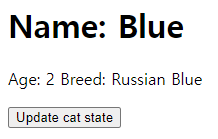
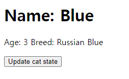

## Case10: React State Update & Immutability

<br>

### 케이스 주제

React의 Props와 State는 모두 불변성(immutability)을 유지하는 것이 필요합니다.<br> 불변성을 유지하면서 상태를 다루게 되면 이 상태를 다루는 함수 내부에서 side effect가 발생할 염려가 줄어듭니다.<br> 함수 내부에서 이 상태를 직접 변경할 수 없어서 추적이 용이해지기 때문입니다.<br> 이러한 불변성을 유지함으로써 얻는 이점들 외에도 컴포넌트가 불필요하게 자주 리렌더링 되는 것을 막는 역할을 하는데,<br> 이전 상태와 다음 상태를 비교할때 객체의 레퍼런스만 비교하는(shallow compare) 값싼 연산으로 리렌더링 여부를 결정하는데 큰 도움이 됩니다.<br> 상태를 immutable하게 관리하는 것에 대해 알아보기 위해서 간단하게 아래와 같은 형태로 Component 클래스를 작성해봅니다.

```javascript
class Component {
  setState(newState) {}
  render() {}
}
```

<br>

### 문제

Q. State를 immutable하게 관리하는 React Class Component를 단순한 방식으로 모방해서 만들어보세요.

<br>

### 요구 및 참고사항

- setState와 render 메서드를 갖는 Component 클래스를 만듭니다.
- setState 메서드는 아래와 같이 작동해야 합니다.
  - newState 파라미터에 대한 유효성 검사를 합니다.
    - newState는 객체 또는 함수 타입을 받습니다. 그 외의 타입이 오면 에러를 내도록 합니다.
  - newState가 객체일 경우에는 this.nextState에 newState를 대입합니다.
  - newState가 함수일 경우에는 newState 함수에 현재 state와 props를 전달해 실행하고 반환된 새 state를 this.nextState에 대입합니다.
  - case4 React State 편에서처럼 state를 병합하지 않는 것은 this.state를 immutable 하게 관리할때와 그렇지 않을때의 컴포넌트 렌더링 작동에 차이를 두기 위함입니다.
  - 마지막으로 this.shouldComponentUpdate(this.nextState) 함수를 실행해 true를 반환했을때만 컴포넌트를 리렌더링 하도록 합니다.
- 이렇게 만든 Component를 import 해서 상속받아 활용하는 코드를 만듭니다.
  - 이 상속해서 만든 컴포넌트에서 setState를 호출해서 리렌더링이 되도록 합니다.
  - 이 상속해서 만든 컴포넌트의 render 함수를 단순하게 외부에서 호출하는 것으로 body tag 하위에 렌더링이 되도록 합니다.
  - 이 컴포넌트에서 shouldComponentUpdate(nextState) {} 메서드를 구현합니다.
  - 만약 this.state를 immutable 하게 관리를 하지 않았다면 state를 다른 값으로 업데이트 하더라도 리렌더링이 되지 않도록 합니다.

<br>

### 기능 작동 이미지

#### 버튼클릭 전



#### 버튼클릭 후



<br>

### 주요 학습 키워드

- JavaScript
  - Class
  - Arrow Function
- Function Parameter Validation

<br>

### 참고 문서

- Using State Correctly: https://reactjs.org/docs/state-and-lifecycle.html#do-not-modify-state-directly
- React state가 불변이어야 하는 이유: https://ljs0705.medium.com/react-state%EA%B0%80-%EB%B6%88%EB%B3%80%EC%9D%B4%EC%96%B4%EC%95%BC-%ED%95%98%EB%8A%94-%EC%9D%B4%EC%9C%A0-ec2bf09c1021

<br>

### 작성해주셔야 하는 question 파일 경로

`./question/index.js`
`./question/React.js`

<br>

### 실행 방법

경로
`./question`
index.html 파일을 브라우저로 열거나 로컬 웹 서버로 실행하기

```bash
npx serve -l 3000
```
