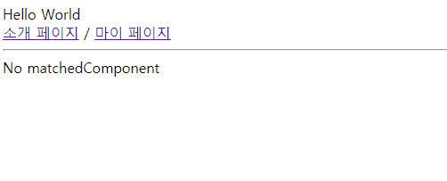

## Case11 : 리액트 라우터의 동작 메커니즘

 

### 케이스 주제 - React Router

`SPA (Single Page Application)`를 개발하는 경우 기존의 웹 애플리케이션과는 다르게 다수의 페이지와 페이지 전환을 다루기 위해 추가적으로 `router`를 고려하게 됩니다.

그러다보면 `react-router-dom`, `vue-router`, `@angular/router`, 등의 **추가적인 패키지**를 설치해서 사용하게 되는데요.

컴포넌트 단위로 코드를 작성하고 그 컴포넌트들을 조합하여 앱을 구성하지만 페이지가 전환되거나 컴포넌트들을 페이지 단위로 배치할때 위와 같은 추가적인 라이브러리를 활용하여 `SPA`의 단점을 보완하는 것입니다.

이번 케이스에서는 추상화된 `Router`를 작성해보도록 하겠습니다

 

### 기능요구사항

#### 주의 사항: 주석 제거 후 해당 요소들도 정상 동작해야합니다

- Link 컴포넌트 구현
- Router 컴포넌트 구현

 

### 기능 작동 이미지

### 문제

- router 함수 구현하기

 

### 주요 학습 키워드

- SPA (Single Page Application)
- Router
- Link

 

### 작성해주셔야 하는 question 파일경로

`./question/index.js`

 

### 실행 방법 및 의존성 모듈 설치

경로
`./question`
index.html 파일을 브라우저로 열거나 로컬 웹 서버로 실행하기
