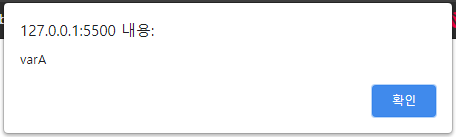
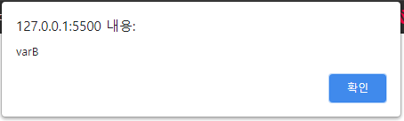

## Case12: webpack

### 케이스 주제

Q. webpack 모듈 번들링의 기능을 구현한다

<br>

### 기능요구사항

1. webpack 사용해보기
2. minipack 으로 구현하기

<br>

### 기능 작동 이미지

<br>

<br>

### 문제

Q. dist파일안에 bundle.js를 생성하여 파일 모듈화를 해보세요

```
$ node minipack.js
```

- 위 명령어를 실행하면
- ./src 폴더안의 index.js 를 번들링 하여 ./dist/bundle.js 에 생성
- index.html 브라우저에서 실행

<br>

### 주요 학습 키워드

- minipack 파일을 참고

<br>

### 작성해주셔야 하는 question 파일 경로

`./question/minipack.js`
`./question/package.json`
`./question/dist/bundle.js`

github 에서 `minipack.js`, `package.json` 파일만 복사해서 붙여주시면 됩니다. (영상참고)

**`bundle.js`는 `index.js`를 모듈화 시켜서 생성해주시면 됩니다**

<br>

### 실행 방법 및 의존성 모듈 설치

**`minipack.js` 와 `pagkage.json` 파일을 작성하신 후 실행하시면 됩니다**

경로 : `./question`

```bash
$ npm install
$ node minipack.js
```

`index.html` 파일을 브라우저로 열거나, <br>
에디터에서 제공하는 live-serve로 `index.html` 실행
