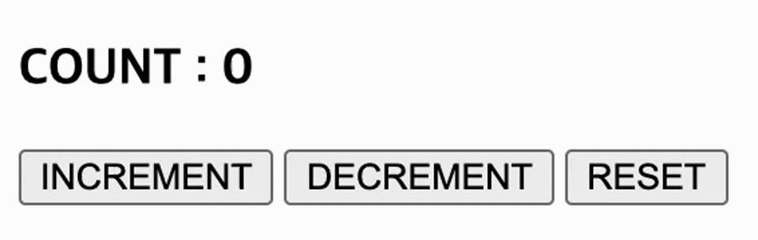

## Case13 : 리덕스의 기본 동작 메커니즘

<br>

### 케이스 주제

Q. 리덕스는 애플리케이션의 모든 상태를 중앙 저장소에서 관리하여 리액트의 상태관리를 효율적으로 할 수 있게 도와주는 라이브러리 입니다.<br>(리액트 뿐만 아니라 다른 뷰 라이브러리와 함께 사용할 수 있습니다.) <br>이 리덕스의 핵심 코드를 직접 작성해 보면서 스토어(Store)를 직접적인 처리가 아닌 액션(Action) - 리듀서(Reducer) - 스토어(Store) - 뷰(View) 패턴으로 구현하면서 리덕스의 동작 원리를 알아봅니다.

<br>

### 기능 요구사항

1. 화면에는 h3 태그의 count 값에 리덕스의 상태값을 표시합니다.
2. INCREMENT 버튼을 클릭시 count 상태를 1증가 시킵니다.
3. DECREMENT 버튼을 클릭시 count 상태를 1감소 시킵니다.
4. RESET 버튼을 클릭시 count 상태를 0로 초기화 시킵니다.

<br>

### 기능 작동 이미지



<br>

### 문제

q1. redux.js - currentState에 접근할수 있도록 getState 함수를 작성하시오.

q2. redux.js - currentState, action을 파라미터로 currentReducer를 실행하여 새로운 currentState 만드는 dispatch 함수를 작성하시오.

q3. redux.js - 상태 변경시 감지를 위해 listener를 배열로 저장하는 subscribe 함수를 작성하고 dispatch 함수에 currentListeners 의 변경을 알려주는 코드를 추가하시오.

<br>

### 주요 학습 키워드

- Redux

<br>

### 작성해주셔야 하는 question 파일경로

`./question/redux.js`

<br>

### 실행 방법 / 풀이 방법 안내

> 문제 풀기 방식 :
>
> 1. 터미널에서 각 문제 폴더 디렉토리로 이동하여 npx serve로 서버를 실행 (또는 에디터 툴의 Live Server를 활용하여 개발서버 실행)
> 2. http://localhost:5000 접속
> 3. 코드 수정하면서 문제 해결하세요

리액트에서 리덕스를 사용할때와 거의 동일하게 파일을 구성하기 위해 script type="module" 을 활용하여 파일을 분리하였습니다.<br> `index.html`을 실행하기 위해 개발서버가 필요합니다. - 문제 디렉토리에서 vscode등 에디터에서 지원해주는<br> `Live Server`로 실행하거나 <br>`npx serve`를 이용하여 개발서버를 실행하세요.

<br>

### 실행 방법 및 의존성 모듈 설치

경로
`./question`

터미널

```bash
  $ npx serve
```
