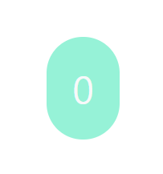

## Case14 : React Redux hooks : useSelector

 

### 케이스 주제

Q. Redux store와 state에 접근하기

 

### 기능요구사항

1. `useStore()` 구현하기
2. `useSelector()` 구현하기

 

### 기능작동이미지

 

### 문제

1. Redux Store에 접근할 수 있는 Hooks를 작성해보세요
2. Redux State에 접근할 수 있는 Hooks를 작성해보세요

 

### 주요 학습 키워드

- React Redux
- useSelector

 

### 작성해주셔야 하는 question 파일 경로

`./question/index.js`

 

### 실행 방법 및 의존성 모듈 설치

경로 : `./question/index.html`

`index.html`에 복잡한 **Babel** 설정을 하지 않기 위해 `CDN`이 포함되어 있으니
`live-server` 등을 이용해 확인하시면서 구현할 수 있습니다.

 

### Reference

- Redux getState() : https://redux.js.org/api/store#getstate
- React Redux - Provider() : https://react-redux.js.org/api/provider#provider
- React Redux - useSelector() : https://react-redux.js.org/api/hooks#useselector
