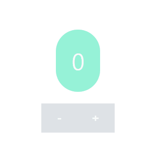

## Case15 : React Redux hooks : useDispatch

 

### 케이스 주제

Q. Redux dispatch에 접근하기

 

### 기능요구사항

1. `useDispatch()` 구현하기
2. `useSelector()` 로직 리팩터링

 

### 기능 작동 이미지

 

### 문제

1. 불필요한 렌더링을 개선
2. Redux dispatch 에 접근하기 위한 hooks 작성

 

### 주요 학습 키워드

- React Redux
- useDispatch

 

### 작성해주셔야 하는 question 파일 경로

`./question/index.js`

 

### 실행 방법 및 의존성 모듈 설치

경로 : `./question/index.html`

`index.html`에 복잡한 **Babel** 설정을 하지 않기 위해 `CDN`이 포함되어 있으니
`live-server` 등을 이용해 확인하시면서 구현할 수 있습니다.

 

### Reference

- Redux dispatch(action) : https://redux.js.org/api/store#dispatchaction
- Redux subscribe(listener) : https://redux.js.org/api/store#subscribelistener
- React Redux - useDispatch() : https://react-redux.js.org/api/hooks#usedispatch
