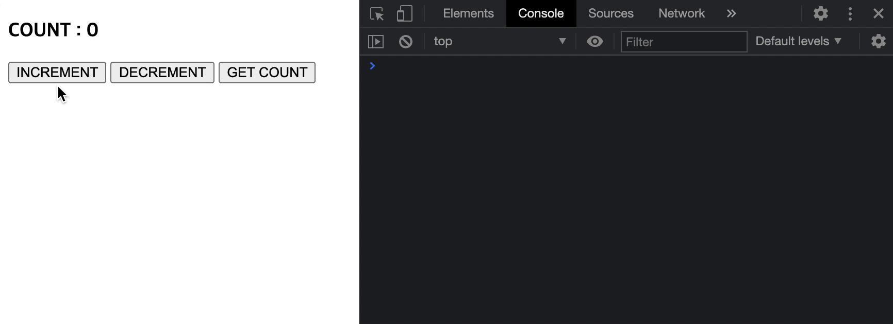

## Case16 : 리덕스 미들웨어의 동작 메커니즘

<br>

### 케이스 주제

Q. 리덕스 미들웨어는 액션과 스토어 사이에 임의의 기능을 넣어 확장하는 방법으로 추가적인 작업을 할 수 있습니다.<br> 액션을 콘솔에 출력하여 로깅을 할 수 있고 비동기 작업을 처리할 수도 있습니다. <br>이 두가지 경우를 직접 구현하면서 리덕스 미들웨어의 동작 원리를 알아봅니다.

<br>

### 기능 요구사항

1. 화면에는 h3 태그의 count 값에 리덕스의 상태값을 표시합니다.
2. INCREMENT/DECREMENT 버튼을 클릭시 count 상태를 1증가/감소 시킵니다. (이때 이전상태와 액션 다음상태를 로깅합니다.)
3. GET COUNT 버튼을 클릭시 getCount 액션을 호출합니다. (이때 h3 태그의 count 값에 loading... 표시를 해줍니다.)
4. getCount 액션호출 2초후에 count 상태를 100으로 초기화 시킵니다. (이때 h3 태그의 count 값에 count 를 표시합니다.)

<br>

### 기능 작동 이미지



<br>

### 문제

q1. middleware.js - 이전상태와 액션 다음상태를 로깅하는 미들웨어 함수를 작성하시오.

q2. middleware.js - action 타입이 function일 경우 action에 store 정보를 넘겨주어 비동기 통신을 할수 있도록 thunk 미들웨어 함수를 작성하시오.

q3. redux.js - 위에서 작성한 미들웨어가 동작할수 있도록 currying을 이용하여 applyMiddleware 부분을 완성하시오. (하단의 compose 함수를 이용하여 배열로 넘어온 미들웨어를 순차적으로 실행할수 있게 합니다.)

<br>

### 주요 학습 키워드

- Redux
- Redux middleware

<br>

### 작성해주셔야 하는 question 파일경로

`./question/redux.js`
`./question/middleware.js`

<br>

### 실행 방법 / 풀이 방법 안내

> 문제 풀기 방식 :
>
> 1. 터미널에서 각 문제 폴더 디렉토리로 이동하여 npx serve로 서버를 실행 (또는 에디터 툴의 Live Server를 활용하여 개발서버 실행)
> 2. http://localhost:5000 접속
> 3. 코드 수정하면서 문제 해결하세요

리액트에서 리덕스를 사용할때와 거의 동일하게 파일을 구성하기 위해 script type="module" 을 활용하여 파일을 분리하였습니다.<br> `index.html`을 실행하기 위해 개발서버가 필요합니다. - 문제 디렉토리에서 vscode등 에디터에서 지원해주는<br> `Live Server`로 실행하거나<br> `npx serve`를 이용하여 개발서버를 실행하세요.

<br>

### 실행 방법 및 의존성 모듈 설치

경로
`./question`

터미널

```bash
  $ npx serve
```
