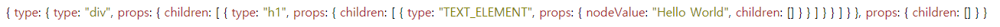

## Case1 : JSX를 사용해 생성하는 React Element

<br>

### 케이스 주제

#### JSX

페이스북의 React 개발팀에서 **React** 를 소개할 때 3가지를 중점으로 설명합니다.<br>
(_선언형, 컴포넌트 기반, 한 번 배워서 어디서나 사용하기_)

그중에서도 **Declarative** (선언형)은 이번 주제와 깊은 연관성이 있는데요

프론트엔드 개발을 하다 보면 유저 인터렉션이 많은 UI를 만들 때 어려움이 발생합니다.  
이에 대응하여 React 는 데이터 변경에 알아서 렌더링 할 수 있는 방법을 제공하고 개발자가 각 상태에 대한 뷰만 설계할 수 있도록 돕습니다.

구체적으로 **Declarative (선언형) View** 를 작성하여 예측 가능한 코드로 드러내는 것을 위해 사용할 수 있는 것이 **JSX** 입니다.

**JSX(Javascript XML)** 는 마치 **HTML** 처럼 보이지만 **JavaScript** 로 인식할 수 있습니다.

이러한 동작이 가능하기 위해 내부적으로 다양한 동작을 하겠지만 기본적으로 **Babel** 이라는 도구를 활용해 트랜스파일링 할 수 있습니다.

<br>

#### React.createElement

React를 처음 접할 때 **JSX** 만으로 컴포넌트를 작성했다면 `React.createElement`를 알지 못하더라도 큰 문제는 없습니다.

사실 **JSX** 는 `React.createElement()`의 **Syntactic Sugar** (문법적 설탕)이기 때문입니다.

기본적으로 `React.createElement()`는 네이밍에서 알 수 있는 의미 그대로 **React Element** 를 생성하고 반환합니다.

또한 **React Element** 는 React에서 가장 작은 단위라고도 할 수 있습니다.

<br>

### 기능요구사항

1. React.createElement를 구현하기
2. JSX Element를 JSON 포맷으로 표시하기

<br>

```js
// JSX Element
const element = (
  <div>
    <h1>Hello World</h1>
  </div>
)
```

```js
// React.createElement()
const element = React.createElement('div', null, React.createElement('h1', null, 'Hello World'))
```

#### JSON 포맷

```json
{
  "type": {
    "type": "div",
    "props": {
      "children": [
        {
          "type": "h1",
          "props": {
            "children": [
              {
                "type": "TEXT_ELEMENT",
                "props": {
                  "nodeValue": "Hello World",
                  "children": []
                }
              }
            ]
          }
        }
      ]
    }
  },
  "props": {
    "children": []
  }
}
```

<br>

### 기능작동이미지


<br>

### 문제

- JSX Element를 JSON 포맷으로 표시하기
  - createElement 함수 작성하기
  - createTextElement 함수 작성하기

문제 풀이를 위해서는 2가지 함수만 작성하면 됩니다.

단순히 2개의 함수를 구현한다고 해서 React의 모든 매커니즘과 동작 방식을 이해할 수는 없습니다.  
때문에 React의 내부 동작을 풀어낸다는 생각으로 문제에 접근한다면
React 개발팀이나 해박한 지식을 가진 개발자가 아니라면 풀어내기 어려울 수 있습니다.

`React.createElement()`를 흉내내며 모방한다는 생각으로 해당 케이스의 문제 풀이에 접근하고 시도해봅시다!

```js
function createElement(type, props = {}, ...children) {
  // TODO: Write code

  return {
    type,
    props: {},
  }
}

function createTextElement(value) {
  // TODO: Write code
}
```

<br>

### 주요 학습 키워드

1. JSX
2. React.createElement

<br>

### 작성해주셔야하는 question 파일경로

`./question/index.js`

<br>

### 실행 방법 및 의존성 모듈 설치

경로 : `./question/index.html`

`index.html`에 복잡한 **Babel** 설정을 하지 않기 위해 `CDN`이 포함되어 있으니
`live-server` 등을 이용해 확인하시면서 구현할 수 있습니다.

<br>

### Reference

- JSX Live Editor : https://jsx.egoist.sh
- Babel REPL : https://babeljs.io/repl/#?presets=react&code_lz=GYVwdgxgLglg9mABACwKYBt1wBQEpEDeAUIogE6pQhlIA8AJjAG4B8AEhlogO5xnr0AhLQD0jVgG4iAXyJA
