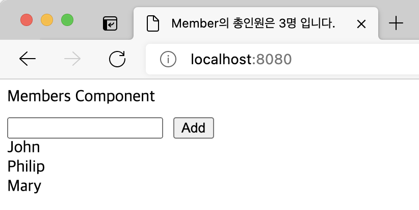

## Case6 : useEffect

### 케이스 주제

Q. react의 useEffect함수를 이해하기 위해 구현을 해보자.

 

### 기능 요구사항

1. effect를 실행하는 함수와 의존성 데이터를 저장한다.

2. html element를 렌더링 후에 effect를 실행할 수 있도록 한다.

3. 의존성 데이터를 비교하여 effect 실행여부를 결정한다.

4. effect 함수를 통해 document의 title을 변경한다.

 

### 기능 작동 이미지

 

### 문제

- q1. effect를 실행함수와 의존성 데이터를 저장하는 useEffect 함수를 작성하시오.

- q2. effect 함수에는 document의 title에 데이터의 갯수를 표현하여 변경을 확인할 수 있도록 작성하시오.

- q3. 의존성 데이터 여부에 따라 effect를 실행하는 함수를 작성하시오.
  case 1) 의존성 데이터가 undefined일 경우에는 effect를 매번 실행
  case 2) 의존성 데이터가 있을 경우에는 데이터 변경 여부를 체크하여 effect를 실행
  (참고: object-hash라이브러리를 통해서 변경여부를 쉽게 파악할 수 있음)

- q4. effect 함수가 반환함수가 있다면 (cleanup) effect 실행전에 실행하도록 작성하시오.

 

### 주요 학습 키워드

- useEffect 함수의 동작원리를 알아보자

 

### 작성해주셔야 하는 question 파일경로

`./src/question/Members.js`

 

### 실행 방법 / 문제 풀이 방법

1. npm install
   Run `npm install`

2. excution
   Run `npm run dev`
