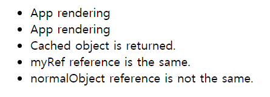

## Case7 : React.useRef

<br>

### 케이스 주제

React의 useRef hook은 기본적으로 원하는 DOM Node에 접근해 reference를 얻는 것에 목적이 있습니다.<br> 그러나 이렇게 DOM Node에 접근하는 용도로도 쓰이지만 useRef는 컴포넌트의 full lifetime 동안 레퍼런스가 유지되는 mutable object를 반환하기 때문에<br> 이전 값을 유지하는 용도로도 사용될 수 있습니다.<br> 즉, useRef는 매 렌더마다 레퍼런스가 고정된 객체를 반환합니다.<br> useRef는 아래와 같은 function signature를 갖고 있습니다.<br> 특정 타입을 갖는 초깃값을 받아 current 프로퍼티에 그 값을 갖는 리터럴 객체를 반환합니다.<br> 이때 이 객체는 seal이나 freeze가 되어있지 않은 객체여서 기존의 프로퍼티를 수정 및 삭제하거나 새 프로퍼티를 추가할 수 있습니다.

```typescript
function useRef<T>(initialValue: T | null): RefObject<T>
```

이때 React hooks는 내부적으로 memory cells라 불리는 객체를 만들어 각 hook들이 몇번, 어떤 순서로 호출되었는지 저장 및 추적합니다. <br>그 뒤 컴포넌트의 state 및 props가 변경되어 rerendering이 되면 hook들이 동일한 순서대로 호출되기 때문에<br> hook을 여러번 사용하더라도 memory cells를 보고 올바른 값을 반환할 수 있습니다.<br> hooks를 조건문이나 반복문에서 사용할 수 없는 것이 바로 이런 이유에서 입니다.

<br>

### 문제

1. useRef를 여러번 사용하는 코드를 만들어보세요.
   - (option) memoryCells & cursor
2. useRef 함수의 로직을 작성해보세요.
   - (option) mocking react event system

<br>

### 요구 및 참고사항

- useRef는 (initialValue) 한개의 파라미터를 받습니다.
  - 이 initialValue는 어떤 값을 가질 수도 있고 null 일 수도 있습니다.
  - 이 initialValue는 `{ current: ... }` 와 같이 리터럴 객체의 current 프로퍼티에 대입됩니다. 값이 전달되지 않으면 undefined가 대입됩니다.
- useRef는 이렇게 만들어진 리터럴 객체를 반환합니다.
- useRef는 컴포넌트가 여러번 리렌더링이 되더라도 캐쉬된 객체를 반환합니다.
  - (option) useRef가 여러번 호출되어도 각 호출에 대해 어떤 값을 반환해야 할지 저장할 memoryCells 객체를 만들어 사용합니다.
  - (option) hook이 몇번 호출되었는지 추적할 수 있도록 cursor라는 변수를 만들어 사용합니다.
  - (option) useRef 호출부에서 rerendering이 되었을때 cursor를 0으로 초기화할 수 있도록 CustomEvent를 사용합니다.

<br>

### 기능 작동 이미지



<br>

### 주요 학습 키워드

- DOM(문서 객체 모델): https://developer.mozilla.org/ko/docs/Web/API/Document_Object_Model/Introduction

<br>

### 참고 문서

- useRef Basics: https://reactjs.org/docs/hooks-reference.html#useref
- Introduction to useRef Hook: https://dev.to/dinhhuyams/introduction-to-useref-hook-3m7n

<br>

### 작성해주셔야 하는 question 파일 경로

`./question/index.js`
`./question/useRef.js`

<br>

### 실행 방법

경로
`./question`
index.html 파일을 브라우저로 열거나 로컬 웹 서버로 실행하기

```bash
npx serve -l 3000
```
