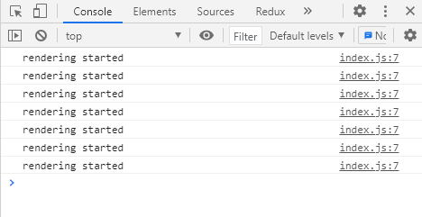

## Case8: React.memo

<br>

### 케이스 주제

React에는 어떤 값이나 함수 또는 컴포넌트를 memoize 할 수 있는 방안으로 memo, useMemo, useCallback 등을 제공합니다. <br>이 중에 이번에 알아볼 memo는 아래의 function signature와 같이 컴포넌트와 memoize 여부를 판단하는 함수를 받아 memoized 된 컴포넌트를 반환합니다.

```typescript
function memo<T extends ComponentType<any>>(
  Component: T,
  propsAreEqual?: (prevProps: Readonly<ComponentProps<T>>, nextProps: Readonly<ComponentProps<T>>) => boolean
): MemoExoticComponent<T>
```

<br>

### 요구 및 참고사항

- memo가 받을 컴포넌트는 함수 컴포넌트를 받는 것으로 가정합니다.
- memo는 (Component, areEqual) 라는 두 파라미터를 받습니다.
  - 이때 areEqual은 optional 입니다.
  - areEqual이 전달되지 않았을 경우에는 default compare function이 사용됩니다.
  - default compare function 역할을 할 함수를 따로 작성해서 사용합니다.
- (Component, areEqual) 두 파라미터에 대한 유효성 검사를 합니다.
  - 유효성 검사에 실패할 경우, 각 경우에 알맞는 메세지와 함께 에러를 발생합니다.
- 마지막으로 memoized 된 함수 컴포넌트를 반환합니다.

<br>

### 기능 작동 이미지

**이번 예제의 결과는 console 창에서만 확인 가능합니다**

<br>

브라우저 콘솔창 여는 법 ( chrome 기준 )

- 윈도우 : Ctrl + Shift + J / F12
- 맥 : Command + Option + J

<br>



<br>

### 문제

Q. React.memo 함수를 단순한 방식으로 모방해서 만들어보세요.

<br>

### 주요 학습 키워드

- JavaScript
  - Closure
  - Arrow Function
  - Default Function Parameter
- Function Parameter Validation

<br>

### 작성해주셔야 하는 question 파일 경로

`./question/index.js`
`./question/memo.js`

<br>

### 실행 방법

경로
`./question`
index.html 파일을 브라우저로 열거나 로컬 웹 서버로 실행하기

```bash
npx serve -l 3000
```
